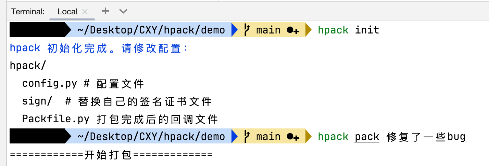

# hpack - HarmonyOS 内测打包分发工具

 - 待发布

## 简介

**[hpack](https://github.com/iHongRen/hpack)** 是一个专为 HarmonyOS 打造的内测分发工具，借助它，你只需一行命令，就能轻松完成鸿蒙应用的构建、打包、签名，并将其上传至服务器进行内测分发。这大大简化了开发流程，提高了开发效率，让你能更专注于应用的开发和优化。


## 功能特性

- **打包签名**：自动打出所有的 hap 和 hsp 包，并对它们进行签名。
- **签名 Manifest.json5**：读取应用打包数据，自动生成已签名的 Manifest.json5 文件。
- **分发 index 页**：自动生成分发页，提供多种 HTML 模板，如 `default`, `tech`, `cartoon`, `tradition`，同时支持自定义模板，满足不同的展示需求。
- **二维码生成**：自动生成应用的二维码，方便内测人员快速下载和安装。
- **OSS 上传**：如果完成配置，可将打包好的所有文件上传到阿里云 OSS 。


## 安装使用

在阅读以下内容之前，我们建议您先详细阅读鸿蒙官方文档 [HarmonyOS 应用内部测试](https://developer.huawei.com/consumer/cn/doc/app/agc-help-harmonyos-internaltest-0000001937800101#section042515172197)。

准备工作三个文件：

1、发布证书： .cer 格式

2、内部测试 Profile:  .p7b  格式

3、私钥文件： .p12 格式

**官方给出的内部测试流程大致如下：**

 


#### 预置环境：

DevEco-Studio IDE，集成了各种命令工具

JDK 17+： 签名工具需要。 `java --version`

python3.7+ ： hpack 由 python 编写

pip3：python 的依赖包工具


####  安装 hpack

```sh
pip3 install harmony-hpack
```

##### 查看帮助信息

```bash
hpack -h # hpack help
```

##### 查看版本信息

```bash
hpack -v # hpack --version
```


#### 初始化

在**项目根目录**下执行以下命令，初始化 `hpack` 目录并创建配置文件：

```bash
hpack init   # 支持缩写 hpack i
```

初始化完成后，会在项目根目录下生成 `hpack` 目录，包含以下文件和文件夹：

```shell
.
├── config.py # 配置文件，服务器、应用信息和打包签名等相关信息。
├── Packfile.py # 打包完成后的回调文件，可用于自定义上传和处理逻辑。
└── sign # 用于存放签名证书文件。

```

#### 完成配置

打开 `hpack/config.py` 文件，根据实际情况修改配置信息：

```python
class Config: 
    # 阿里云OSS配置 - 如果您不使用阿里云OSS，则不用修改
    Access_key_id = 'your Access_key_id'
    Access_key_secret = 'your Access_key_secret'
    Endpoint = 'your Endpoint'
    Bucket_name = 'your Bucket_name'
    Bucket_dir = 'hpack'
    
    # 安装包存放的服务器的域名 
    DeployDomain = 'static.hpack.com'
    
    # 安装包存放的服务器地址，必须是 https
    BaseURL = f"https://{DeployDomain}/{Bucket_dir}"

    # 应用信息 
    AppIcon = f"{BaseURL}/AppIcon.png"
    AppName = 'hpack'
    Badge = '鸿蒙版'
    
    # index模板选择, 可选值为 [default, tech, cartoon, tradition, custom]
    # 如果是 custom，则表示自定义模板，需要自己在 hpack 目录写一个 index.html，
    # 打包完成后进行内容填充，再写入 hpack/build 目录
    IndexTemplate = "default" 

    # 打包签名配置 
    Alias = 'your key alias'
    KeyPwd = 'your key password'
    KeystorePwd = 'your store password'
    # 替换 hapck/sign 目录下的证书文件
    SignDir = 'sign'
    Cert = os.path.join(SignDir, 'release.cer') 
    Profile = os.path.join(SignDir, 'test_release.p7b')  
    Keystore =  os.path.join(SignDir, 'harmony.p12')
```


替换 hapck/sign 目录下的证书文件

```shell
.
├── harmony.p12   # 私钥文件
├── release.cer   # 发布证书
└── test_release.p7b  # 内部测试Profile
```


#### 打包与上传

执行以下命令进行打包、签名和上传操作，可选择性地添加更新说明：

```bash
hpack pack "修复了一些已知问题，优化了性能" # 缩写 hpack p [desc]
```


#### 示例图




### 自定义分发页 index.html

如果你想使用 hpack 提供的 HTML 模板来做进一步修改，可以执行以下命令：

```bash
hpack template [tname] # 缩写 hpack t tech
```

`tname` 可选值为 `default`, `tech`, `cartoon`, `tradition`，如果不指定，默认使用 `default` 模板。

这个命令会在 hpack/ 目录下生成对应的 index.html 模板文件，在打包完成以后，我们可以定义自己的变量来填充这个模板，然后得到真实的 index.html 文件并写入到 hpack/build 目录下，以方便上传。

## 贡献

如果你有任何建议或发现了 bug，欢迎提交 issues 或 pull requests，让 `hpack` 变得更好！