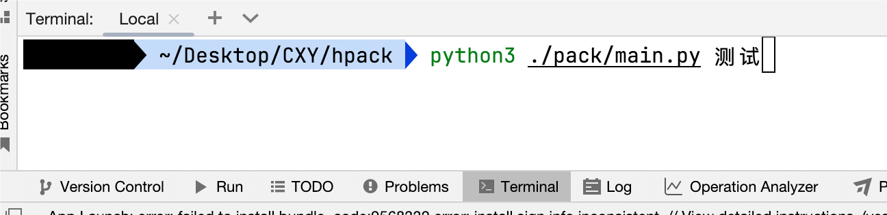
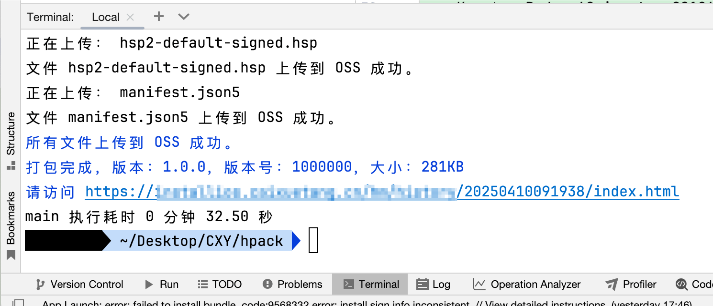
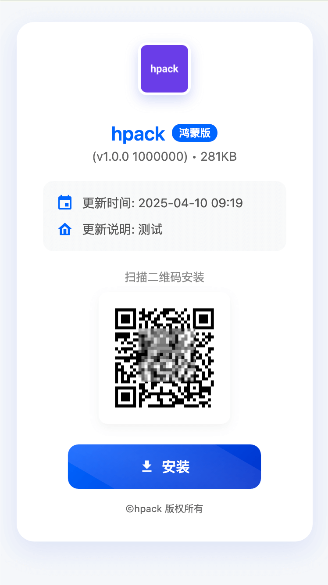
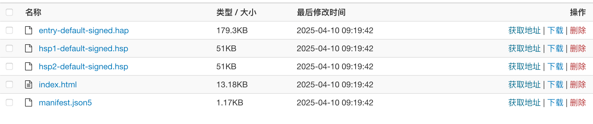

### [hpack](https://github.com/iHongRen/hpack) 简介

**[h-pack](https://github.com/iHongRen/hpack)** 是一个针对HarmonyOS的内测分发工具，一行命令完成鸿蒙应用的构建打包、签名、上传到阿里云OSS进行内测分发。


### 如何使用

#### 1、预置环境：

DevEco-Studio 开发工具

JDK 17+： 签名工具需要。 `java --version`

python3.5+ ： hpack使用python

pip3：python的依赖包工具

[阅读官方文档 - 搭建流水线](https://developer.huawei.com/consumer/cn/doc/harmonyos-guides-V5/ide-command-line-building-app-V5)


#### 2 使用hpack
直接拷贝pack文件夹到你的工程根目录下

在终端切换到pack目录，安装依赖

```sh
pack> pip3 install -r requirements.txt
```


#### 3、修改默认配置

在pack/sign 目录更换你的打包证书，[如何申请内部测试证书](https://developer.huawei.com/consumer/cn/doc/app/agc-help-harmonyos-internaltest-0000001937800101#section166959440414)

修改config.py 配置文件

```python
# 阿里云OSS配置
Access_key_id = 'your Access_key_id'
Access_key_secret = 'your Access_key_secret'
Endpoint = 'your Endpoint'
Bucket_name = 'your Bucket_name'
Bucket_dir = 'hpack'
Cname = 'your cname'

# 应用名称和图标
AppName = 'hpack'
AppIcon = f"https://{Cname}/xx/AppIcon.png"

# 打包签名配置 
PackDir = 'pack'
SignDir = 'sign'
Cert = os.path.join(PackDir, SignDir, 'release.cer') 
Profile = os.path.join(PackDir, SignDir, 'test_release.p7b')  
Keystore =  os.path.join(PackDir, SignDir, 'harmony.p12') 
Alias = 'your key alias'
KeyPwd = 'your key password'
KeystorePwd = 'your store password'
```


#### 4、在工程根目录执行脚本

**需要使用DevEco-Studio 自带的自终端**， 其他的得去配置 hvigorw的[环境变量](https://developer.huawei.com/consumer/cn/doc/harmonyos-guides/ide-command-line-building-app#section1411782572213)

**Linux / Mac :** 

```sh
> python3 ./pack/main.py 这里写您的更新说明可空
```

**Windows :** 

```shell
> python3 .\pack\main.py 这写您的更新说明可空
```


#### 5、运行
- 终端运行



- 执行成功



- 分发的index.html页面



- 在oss中查看上传的包



### Tips:

1、如果已安装的 App 和准备要安装的 App 打包证书不一致，需先卸载已安装的 App 。

2、安装时鸿蒙会进行联网校验，手机如果开了代理需要注意下。

3、安装出错时会有提示，根据错误码找原因。[错误码说明](https://developer.huawei.com/consumer/cn/doc/app/agc-help-harmonyos-internaltest-0000001937800101#section10455110143313)。

4、如果您直接使用本工程做测试，还需要修改 app.json5 里的 bundleName。

5、hap/hsp包[签名工具](https://gitee.com/openharmony/developtools_hapsigner) 和 manifest.json5[验签工具](https://gitee.com/arkin-internal-testing/internal-testing)，如果官方有更新，需自行替换。

6、python执行生成缓存的文件，可在.gitigore文件中添加忽略，或者使用`python3 -B pack/main.py   `

```txt
.gitigore 文件
# 忽略 __pycache__ 目录
__pycache__/
```

<br>

> #### 如果有帮助到您，欢迎star、提issues、PR。